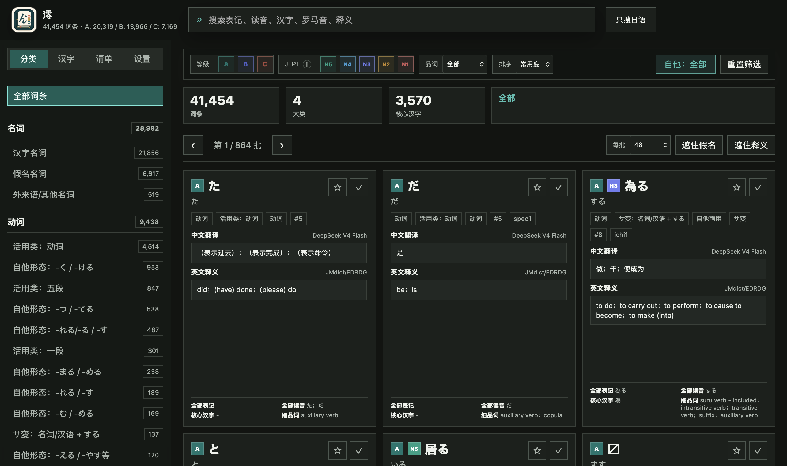
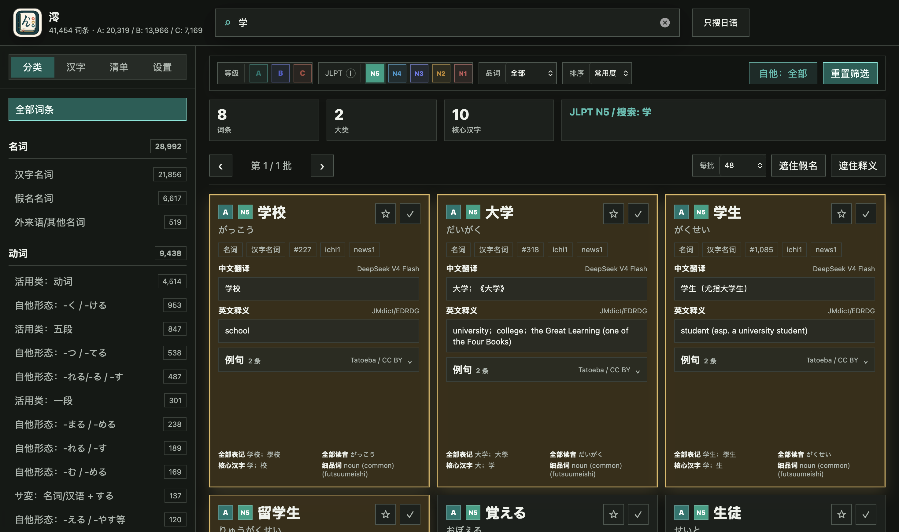
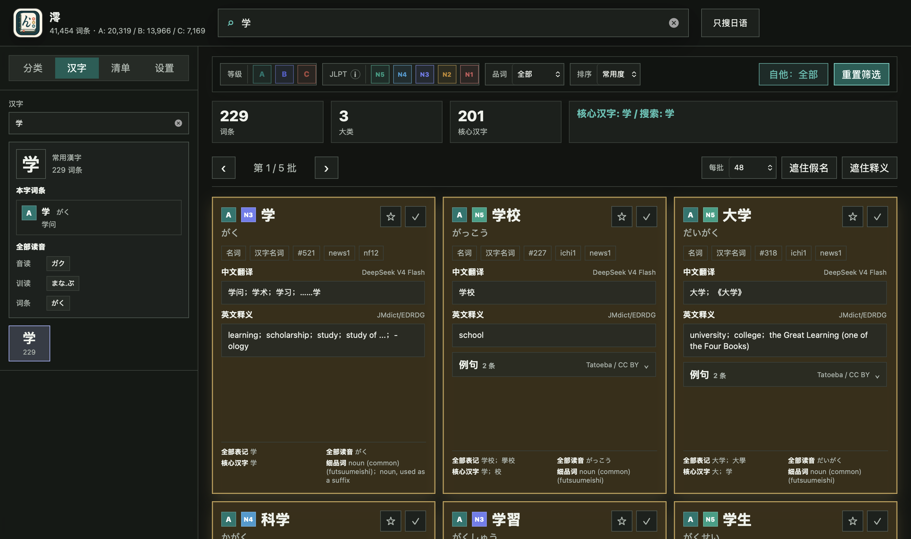
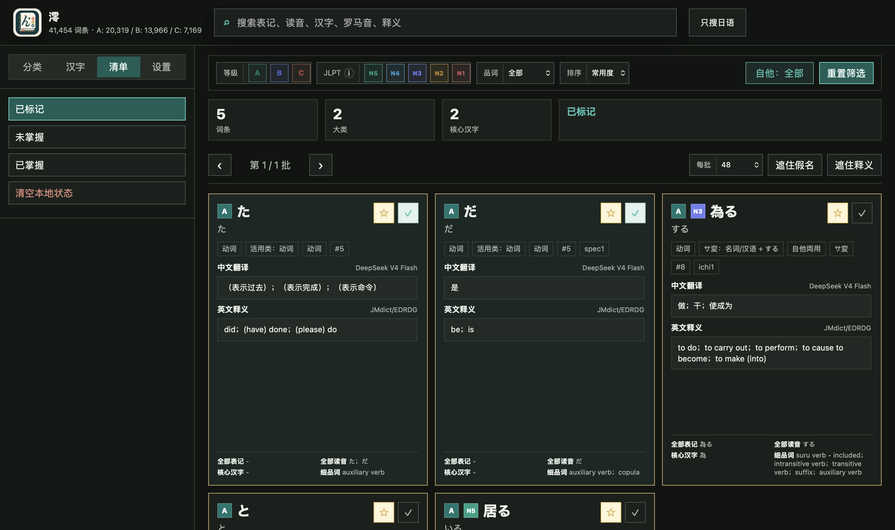

<div align="center">
  
  <h1>澪 · Mio Jisho</h1>
  <p>面向日语学习与词汇研究的本地优先词典。</p>
</div>

Mio Jisho 将词条检索、结构化释义、JLPT 参考等级、汉字索引和本地学习记录整合在一个纯静态 Web 应用中。无需安装前端依赖，也无需账号或后端服务。



## 特色功能

### 多维检索与筛选

支持按表记、读音、汉字、罗马音和释义搜索，并可切换“只搜日语”模式。结果可以继续按 A/B/C 数据等级、JLPT N5-N1 参考等级、品词、自他动词和常用度组合筛选。



### 结构化词条

每张词条卡片集中展示：

- 中文翻译与英文释义
- 全部表记、全部读音和核心汉字
- 品词、活用类型、自他属性和频率排名
- JLPT 参考等级与数据来源提示
- 来自 Tatoeba 的中日双语例句

### 汉字索引

可按汉字、假名读音或罗马音检索汉字。选中汉字后，会显示字级信息、音读、训读、本字词条以及所有包含该字的词汇。



### 本地学习清单

词条可以标记为“收藏”或“已掌握”，并通过独立清单集中复习。学习进度保存在浏览器本地，也可以导出为 JSON 后在其他浏览器中恢复。



此外还提供：

- 遮住假名与遮住释义的回忆练习模式
- 浅色、深色和跟随系统主题
- 自定义背景、背景透明度与面板透明度
- 每批 24 / 48 / 96 / 200 条的分页阅览
- 本地数据导入、导出和带确认的清理操作

## 数据规模

当前构建包含：

| 数据 | 数量 |
| --- | ---: |
| 总词条 | 41,454 |
| 名词 | 28,992 |
| 动词 | 9,438 |
| 一类形容词 | 549 |
| 二类形容词 | 2,475 |
| 核心汉字 | 3,570 |
| JLPT 参考词条 | 6,441 |

JLPT 词汇等级并非 JLPT 官方发布词表，而是第三方参考标注，界面中会保留来源和提示。

## 运行

应用已经构建在 `outputs/lexicon_app`，不需要安装 npm 包。

直接打开：

```text
outputs/lexicon_app/index.html
```

或者在仓库根目录启动本地静态服务器：

```bash
python3 -m http.server 8000 --directory outputs/lexicon_app
```

然后访问：

```text
http://localhost:8000
```

## 项目结构

```text
.
├── docs/images/                 # README 运行截图
├── outputs/
│   ├── lexicon_app/             # 可直接运行的静态词典
│   └── mio_jisho/               # 工作簿与构建预览
└── work/
    ├── scripts/                 # 数据清洗、匹配、构建与导出脚本
    ├── build/                   # 中间构建结果（默认忽略）
    └── data/                    # 本地数据源（默认忽略）
```

## 数据来源

项目构建过程使用或整合了以下公开数据：

- JMdict / EDRDG：词条、表记、读音和英文释义
- KANJIDIC2：汉字读音与字级信息
- BCCWJ 相关频率数据：词频与常用度排序
- Tatoeba：日中例句，界面标注为 CC BY
- Tanos JLPT：非官方 JLPT 参考等级，界面标注为 CC BY

各数据集仍遵循其原始许可与署名要求。项目自身目前尚未附带统一的开源许可证。

## 本地数据

收藏、掌握状态、显示偏好和自定义背景默认只保存在当前浏览器中，不会上传到服务器。更换浏览器或清理浏览器数据前，建议先在“设置 → 本地数据”中导出备份。
